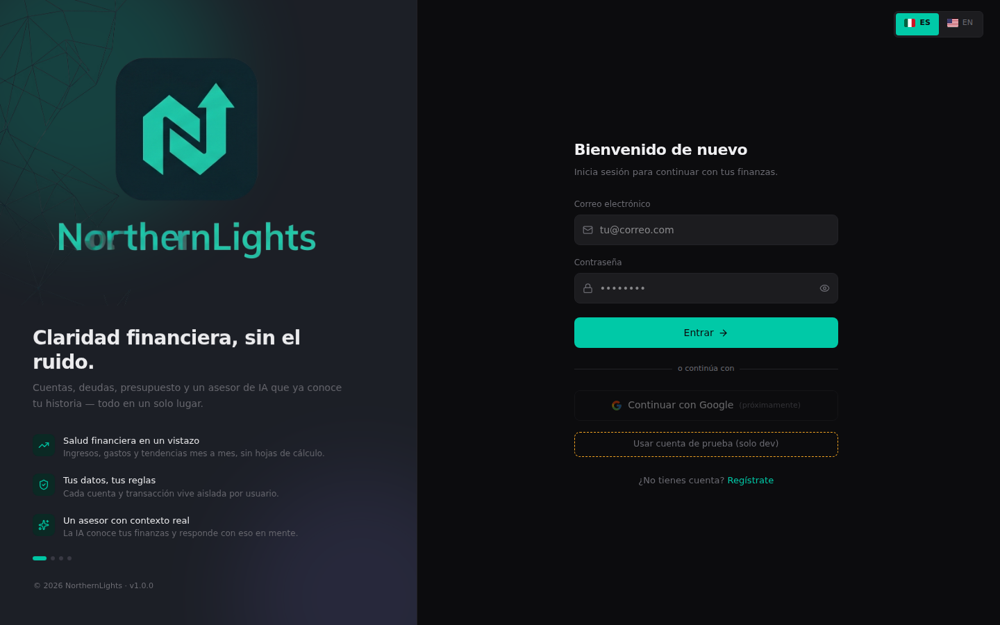
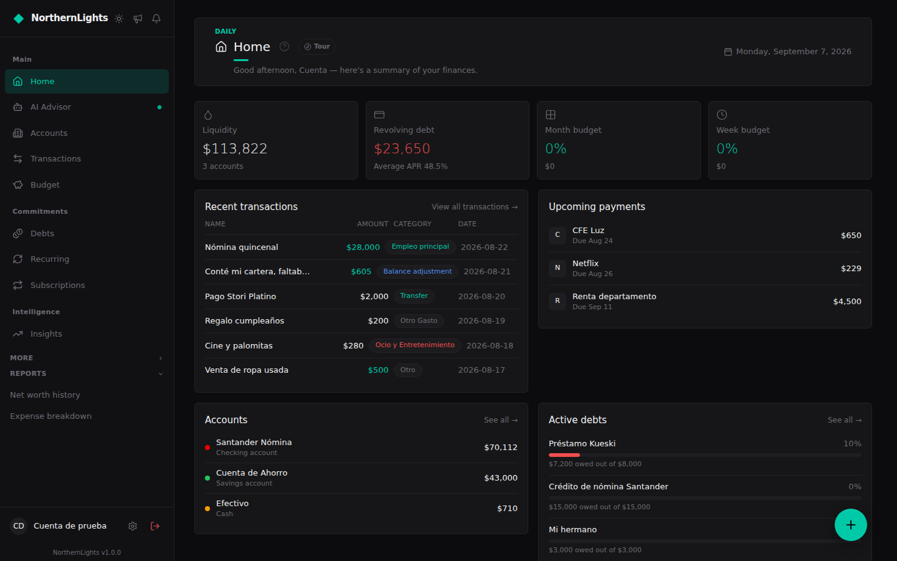
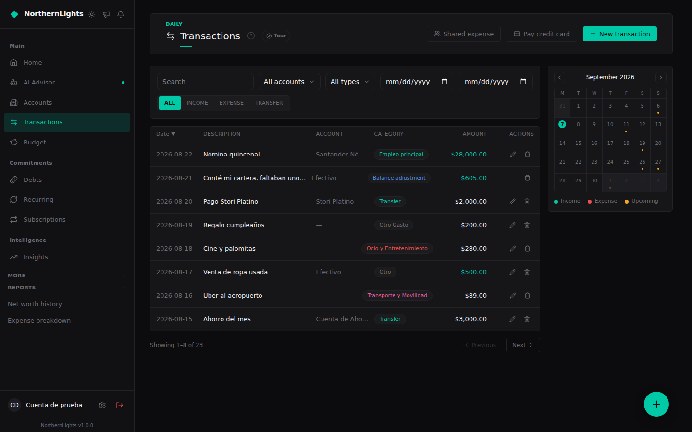
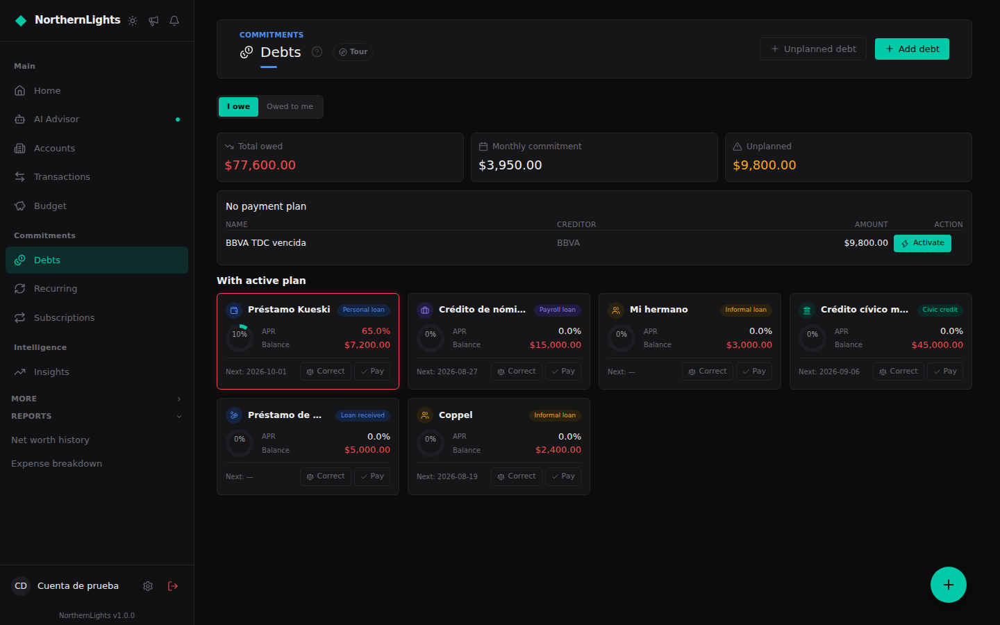
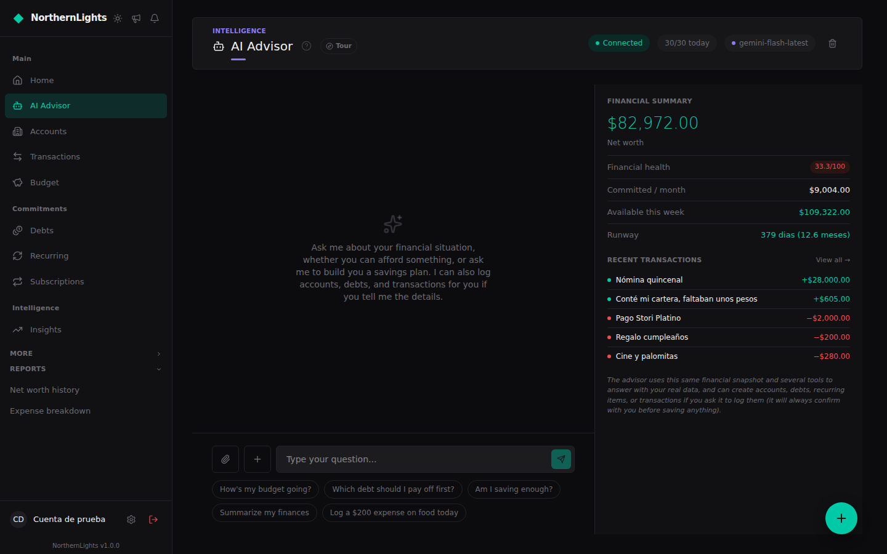

# NorthernLights — Finanzas Personales

Una app web de finanzas personales con contabilidad de doble entrada real por debajo, seguimiento de deudas, presupuesto, gastos recurrentes/suscripciones, reportes históricos, y un asesor financiero con IA (Claude/Gemini) que puede leer tus datos reales y crear transacciones por ti vía chat. Interfaz bilingüe (español/inglés), cambiable en cualquier momento.

Construida en solitario, de punta a punta: diseño del esquema, un modelo real de Row-Level Security de Postgres (no solo un `WHERE user_id = ?`), el libro contable de doble entrada, el loop de tool-calling de la IA, y el frontend sobre todo eso.

## Capturas

| | |
|---|---|
|  |  |
|  |  |

<p align="center"></p>

## Stack

- **Backend:** Python 3.12, FastAPI, SQLAlchemy 2.0 (async, asyncpg), PostgreSQL 16, Redis 7, Celery, Alembic. Gestor de paquetes: `uv`.
- **Frontend:** React 19, TypeScript, Vite 8, Tailwind CSS v4, shadcn/ui (Base UI), TanStack Query v5, Zustand, React Router v7, react-i18next.
- **IA:** proveedor intercambiable vía `AI_PROVIDER` — Gemini (`gemini-flash-latest`, default) o Claude (`claude-sonnet-4-6`), function calling + streaming.
- **Auth:** JWT propio (access + refresh token con rotación) + Google OAuth opcional.

## Estructura del repo

```
northern_lights/
├── backend/
│   ├── app/
│   │   ├── ai/            # providers (claude.py/gemini.py), prompts, tools del asesor
│   │   ├── core/           # config, database (RLS), security (JWT), celery, redis
│   │   ├── models/         # SQLAlchemy ORM
│   │   ├── routers/        # endpoints FastAPI (uno por módulo)
│   │   ├── schemas/        # Pydantic
│   │   ├── services/       # lógica de negocio (un archivo por módulo)
│   │   └── tasks/          # jobs de Celery (alertas, reportes, recurrentes, etc.)
│   ├── alembic/versions/   # migraciones (una cadena lineal, sin branches)
│   └── tests/               # pytest, DB real (finanzas_test) por transacción/savepoint
├── frontend-web/
│   └── src/
│       ├── pages/           # una página por ruta principal
│       ├── components/nl/   # componentes compartidos del dominio (charts, help, etc.)
│       ├── components/ui/   # shadcn/ui
│       ├── hooks/            # un hook por recurso (TanStack Query)
│       ├── locales/          # namespaces de traducción de i18next (es/en)
│       └── lib/              # utils, charts SVG propios, category icons
├── docs/
│   ├── SETUP.md             # paso a paso para correrlo local
│   ├── legal/DISCLAIMER.md  # aviso de privacidad (copia legible; el texto real vive en frontend-web/src/lib/disclaimer.ts)
│   ├── DISCLAIMER_INPUTS.md # inventario de features/datos usado como insumo para el disclaimer
│   ├── CONVENTIONS.md       # nomenclatura de branches y commits
│   └── RELEASING.md         # checklist para liberar una versión y redactar el changelog
├── CLAUDE.md                # instrucciones para agentes de IA que trabajen en este repo
└── docker-compose.yml       # solo pgAdmin (opcional) — Postgres/Redis son nativos, no Docker
```

## Arquitectura — decisiones no obvias

- **Doble entrada contable:** cada `JournalEntry` (transacción visible al usuario) tiene 2+ `JournalLine` (debe/haber) contra `Account`. Para income/expense simples el usuario nunca ve ni elige la cuenta contable interna del otro lado (`account_service.get_or_create_category_ledger_account`) — solo aplica en transfers, préstamos y gastos compartidos.
- **RLS de verdad, no decorativo:** todas las tablas con datos de usuario tienen `ALTER TABLE ... FORCE ROW LEVEL SECURITY` (parte de la migración inicial `293528f67338`). Sin `FORCE`, Postgres exime al dueño de la tabla de sus propias policies — y el rol de la app es el dueño. Cada request autenticado pasa por `get_rls_db`, que hace `SET LOCAL app.current_user_id` antes de tocar cualquier tabla de usuario. `current_setting(..., true)` no da `NULL` cuando la variable nunca se seteó en la sesión (da `''`, que revienta el cast a `uuid`) — todas las policies envuelven el cast con `NULLIF(..., '')` (migración `a48efe292423`).
- **Rol `finanzas_admin`:** único bypass deliberado de RLS, de solo lectura (`SELECT` nada más, ni siquiera puede escribir). `finanzas_user` es miembro suyo; `get_admin_db` hace `SET LOCAL ROLE finanzas_admin` sobre la misma conexión de siempre (no hay una segunda pool/engine).
- **Categorías del sistema:** filas de `categories` con `user_id IS NULL`, fijas para todos los usuarios (9 de gasto + 3 de ingreso, sembradas directo en la migración inicial `293528f67338`). El asesor de IA y la importación por Excel resuelven categoría por nombre exacto (case-insensitive) contra las que existan en ese momento — si cambias los nombres, actualiza también la lista hardcodeada en `app/ai/advisor.py` (system prompt) y `frontend-web/src/pages/ImportarDatos.tsx` (texto de ayuda).
- **Refresh tokens hasheados + rate-limit de login:** `devices.refresh_token` guarda `sha256(token)`, nunca el valor real — una fuga de esa tabla no entrega sesiones listas para usar. 5 intentos fallidos de login (por email, vía Redis) bloquean 15 minutos.
- **Montos como string:** los campos `Decimal` del backend se serializan como string en JSON (`json_safe()`), nunca como `number` — el frontend siempre hace `Number(valor)` antes de `toLocaleString`/aritmética, nunca asume que ya es numérico.
- **i18n de verdad, no un find-and-replace:** los archivos de locale están separados por namespace (`common`/`pages`/`tours`/`categories`), los plurales usan las keys reales `_one`/`_other` de i18next en vez de ternarios manuales `${n===1?'':'s'}`, y el contenido que es dato (no texto de UI) — nombres de categorías del sistema, las respuestas de la IA — se dejó deliberadamente fuera de la capa de traducción en vez de forzarlo — ver `frontend-web/src/lib/categoryIcons.ts` para cómo se separa un label traducido del id estable por el que se busca.

## Mapa de funcionalidades

| Módulo | Router backend | Service(s) | Página frontend |
|---|---|---|---|
| Auth / perfil / dispositivos | `auth.py` | `auth_service.py`, `google_auth_service.py` | `Login`, `Register`, `Settings`, `AuthCallback` |
| Cuentas | `accounts.py` | `account_service.py` | `Accounts` |
| Categorías | `categories.py` | `category_service.py` | `Categorias` |
| Transacciones | `transactions.py` | `transaction_service.py` | `Transactions` |
| Deudas | `debts.py` | `debt_service.py` | `Debts` |
| Recurrentes / suscripciones | `recurring.py` | `recurring_service.py` | `Recurring`, `Subscriptions` |
| Presupuesto | `budget.py` | `budget_service.py` | `Budget` |
| Motor financiero (snapshot, salud) | `engine.py` | `engine_service.py` | `Dashboard` |
| Insights | `insights.py` | `insight_service.py` | `Insights` |
| Reportes | `reports.py` | `report_service.py`, `report_insight_service.py` | `Reports` |
| Asesor IA | `ai.py` | `chat_service.py`, `app/ai/*` | `Advisor` |
| Notificaciones | `notifications.py` | `notification_service.py`, `push_service.py` | `Notifications` |
| Importación masiva (Excel) | `bulk_import.py` | `bulk_import_service.py` | `ImportarDatos` |
| Exportar/borrar mis datos | `data.py` | `data_service.py` | `Settings` |
| Admin | `admin.py` | `admin_service.py` | `Admin` |
| Feedback (bug/feature desde el modal de novedades) | `feedback.py` | `feedback_service.py` | — (modal, no página propia) |

## Pendientes conocidos

- Sin proveedor de email real conectado — `app/tasks/email.py` solo loguea, el flujo de "olvidé mi password" funciona de punta a punta en backend pero no tiene pantalla en el frontend.
- Sin proveedor de push (Firebase) configurado por default — `push_service.py` es no-op silencioso sin `FIREBASE_CREDENTIALS_JSON`.
- Google OAuth requiere crear un proyecto real en Google Cloud Console — sin `GOOGLE_CLIENT_ID`/`GOOGLE_CLIENT_SECRET`, ese botón redirige a una URL que Google rechaza (no rompe el resto de la app).
- Celery worker/beat no arrancan solos — hay que levantarlos aparte si quieres los jobs periódicos.
- El asesor de IA y los insights/reportes generados hoy responden en español sin importar el idioma de la UI; por ahora solo la interfaz misma es completamente bilingüe.

## Cómo correrlo local

¿Quieres correrlo de verdad? El paso a paso completo (base de datos, variables de entorno, el único rol manual de Postgres, tests) está en **[docs/SETUP.md](docs/SETUP.md)**.
